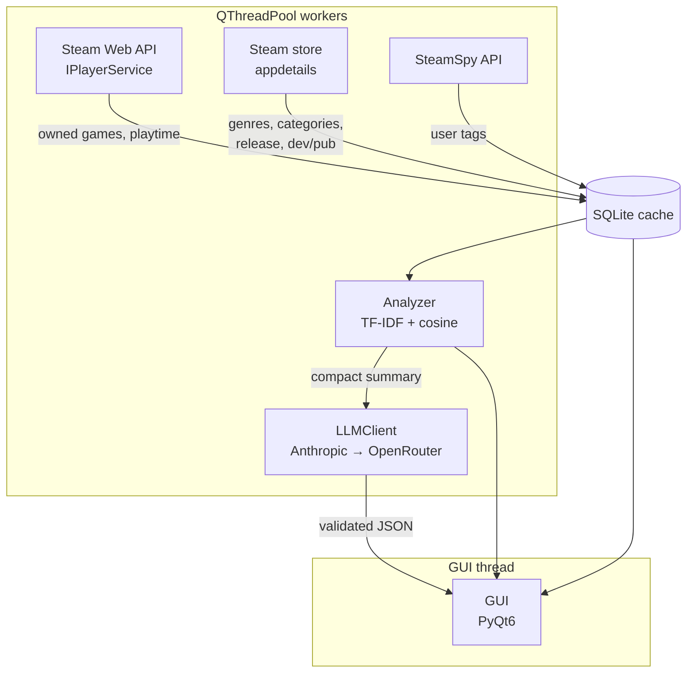

# IMPLEMENTATION_PLAN.md

## 1. Overview

A personal PyQt6 desktop tool that pulls your Steam library, analyses the genres and tags of games you've actually put hours into, and recommends one **owned-but-unplayed** game per genre — your backlog, ranked. A Claude (or OpenRouter fallback) call turns the top shortlist into a human-readable pick per genre with reasoning. Success criterion: from a cold start on a machine with the user's `.env`, running `poetry install && poetry run ludomancer` fetches the library, runs analysis, produces a recommendation per genre, and displays all three views without manual intervention, in under 60 seconds on a warm cache.

### Key definitions

- **Played game**: owned game with total playtime ≥ 3 hours. Used to build preference signal.
- **Backlog game**: owned game with total playtime < 3 hours (includes zero-playtime). Recommendation candidates are drawn exclusively from this set.
- **Active genre**: any genre that has at least one owned game. No playtime threshold — every genre the user has touched gets a recommendation attempt, and genres with no played games fall back to the global preference centroid.
- **Recommendation**: a backlog game chosen from a genre, with a short reason linking it to games the user already enjoys.

## 2. Architecture



All network I/O, SQLite writes, and analysis work run on `QThreadPool` workers and communicate back to widgets over Qt signals. The GUI thread only reads from the cache and renders. The three external sources are separate modules because their rate-limit profiles, auth, and failure modes differ materially — treating them as one class has been the single biggest source of friction in similar personal Steam tools.

## 3. Module breakdown

### Tooling (authoritative)

**Poetry is the single source of truth for dependencies, virtual environment, packaging, and task running.** Every command in this plan runs inside Poetry's managed venv:

- Environment creation and dependency install: `poetry install` (creates the venv; no manual `python -m venv`, no `pip`, no `requirements.txt`).
- Adding a dependency: `poetry add <pkg>` (runtime) or `poetry add --group dev <pkg>` (dev).
- Running the app: `poetry run ludomancer` (via the script entry defined below). `poetry run python -m ludomancer` also works and is equivalent.
- Tests: `poetry run pytest`.
- Lint/format: `poetry run ruff check .` and `poetry run ruff format .`.
- Shell-in: `poetry shell` is acceptable for interactive use but never required in docs or scripts — always prefer explicit `poetry run ...` in this plan's done-when criteria.

No command in this plan should be run outside Poetry. If something needs `pip`, that's a signal to stop and re-express it as a Poetry operation.

### Package layout

All paths are relative to the repo root. Package is `src/ludomancer/`, installed as an editable package by `poetry install` using Poetry's `packages = [{ include = "ludomancer", from = "src" }]` convention.

### `src/ludomancer/config.py`
Single responsibility: typed settings loaded from `.env`.
- `class Settings(BaseSettings)`: `steam_api_key: str`, `steam_id64: str`, `anthropic_api_key: str | None`, `openrouter_api_key: str | None`, `anthropic_model: str = "claude-sonnet-4-5"`, `openrouter_model: str = "anthropic/claude-sonnet-4.5"`, `cache_db_path: Path`, `http_timeout_s: float = 15.0`.
- `def get_settings() -> Settings`: memoised accessor.

Depends on: `pydantic-settings`.

### `src/ludomancer/cache/db.py`
Single responsibility: SQLite connection, schema creation, WAL mode, schema-version check.
- `def get_connection(path: Path) -> sqlite3.Connection`: returns a connection with `PRAGMA journal_mode=WAL`, `PRAGMA foreign_keys=ON`, row factory set.
- `def ensure_schema(conn: sqlite3.Connection) -> None`: creates tables `owned_games`, `game_metadata`, `steamspy_tags`, `llm_responses`, `schema_version`. On version mismatch, drops and rebuilds (personal tool — rebuild is safe).
- `SCHEMA_VERSION: int`.

Depends on: stdlib only.

### `src/ludomancer/cache/repository.py`
Single responsibility: typed read/write helpers on top of the raw connection. No other module writes SQL.
- `class GameRepository`: methods `upsert_owned_games(games: list[OwnedGame]) -> None`, `upsert_metadata(m: GameMetadata) -> None`, `upsert_tags(appid: int, tags: dict[str, int]) -> None`, `get_owned_games() -> list[OwnedGame]`, `get_metadata(appid: int) -> GameMetadata | None`, `get_all_metadata() -> list[GameMetadata]`, `owned_fetched_at() -> datetime | None`, `metadata_fetched_at(appid: int) -> datetime | None`.

Depends on: `cache/db.py`, `models.py`.

### `src/ludomancer/cache/ttl.py`
Single responsibility: cache freshness policy.
- `OWNED_GAMES_TTL = timedelta(hours=24)`, `METADATA_TTL = timedelta(days=30)`, `TAGS_TTL = timedelta(days=30)`.
- `def is_fresh(fetched_at: datetime | None, ttl: timedelta) -> bool`.

Depends on: stdlib only.

### `src/ludomancer/fetchers/web_api.py`
Single responsibility: Steam Web API (`api.steampowered.com`). Official, stable, generous rate limits.
- `class SteamWebAPIClient`: `def get_owned_games(steam_id64: str) -> list[OwnedGame]`. Uses `IPlayerService/GetOwnedGames` with `include_appinfo=1&include_played_free_games=1`.
- Internal retry with exponential backoff on 5xx and connection errors. Surfaces a dedicated `PrivateProfileError` if the response is empty or `games` is missing (common cause: private profile).

Depends on: `httpx`, `config.py`, `models.py`.

### `src/ludomancer/fetchers/store.py`
Single responsibility: Steam store `appdetails` endpoint (`store.steampowered.com/api/appdetails`). Undocumented, rate-limited to ~200 requests per 5 minutes per IP.
- `class StoreMetadataClient`: `def get_metadata(appid: int) -> GameMetadata | None`. Enforces a ≥ 1.5s sleep between calls (conservative); honours 429 with exponential backoff capped at 5 minutes.
- Tolerant parser: every store-only field (`developers`, `publishers`, `release_date`, `genres`, `categories`) is optional in the response and returned as `None`/empty list on absence.

Depends on: `httpx`, `models.py`.

### `src/ludomancer/fetchers/steamspy.py`
Single responsibility: SteamSpy (`steamspy.com/api.php?request=appdetails&appid=...`). Undocumented, occasional outages, looser rate limits than the store.
- `class SteamSpyClient`: `def get_tags(appid: int) -> dict[str, int]`. Returns tag-name → vote-count dict. Empty dict on 404 or outage (not a fatal error — tags are nice-to-have).

Depends on: `httpx`.

### `src/ludomancer/services/library_sync.py`
Single responsibility: orchestrate a full library refresh respecting cache TTLs. This is the only place that knows about all three fetchers.
- `class LibrarySyncService`: `def sync(force: bool = False, progress: Callable[[str, float], None] | None = None) -> SyncResult`. Steps: (1) refresh owned games if TTL expired or `force=True`; (2) for each appid missing metadata or with expired metadata TTL, fetch store details; (3) same for SteamSpy tags; (4) report progress via callback (for Qt signal bridging).
- `@dataclass SyncResult`: counts of fetched/skipped/failed per source.

Depends on: all three fetchers, `cache/repository.py`, `cache/ttl.py`.

### `src/ludomancer/analysis/features.py`
Single responsibility: build the TF-IDF matrix over owned games.
- `def build_corpus(games: list[EnrichedGame]) -> list[str]`: concatenates `tags + genres + categories` per game into a space-joined document. Tags are weighted by repetition proportional to `log1p(vote_count)` so popular tags get emphasis in the TF-IDF space without dominating it.
- `def fit_vectorizer(corpus: list[str]) -> tuple[TfidfVectorizer, sparse.csr_matrix]`: lowercase, `min_df=1`, `sublinear_tf=True`, no stop words (game tags are already content-rich).

Depends on: `scikit-learn`, `models.py`.

### `src/ludomancer/analysis/recommender.py`
Single responsibility: produce a ranked shortlist of backlog games per genre. **See section 5 for the algorithm.**
- `def classify(games: list[EnrichedGame]) -> tuple[list[EnrichedGame], list[EnrichedGame]]`: splits into `(played, backlog)` by the 3-hour threshold.
- `def genre_centroid(played: list[EnrichedGame], genre: str | None, matrix: sparse.csr_matrix, game_index: dict[int, int]) -> np.ndarray`: playtime-weighted centroid. `genre=None` gives the global centroid (used as fallback for genres with no played games).
- `def recommend(games: list[EnrichedGame], matrix: sparse.csr_matrix, top_k_per_genre: int = 3) -> list[GenreShortlist]`: returns one `GenreShortlist` per active genre with up to `top_k_per_genre` backlog candidates.

Depends on: `numpy`, `scipy`, `models.py`, `analysis/features.py`.

### `src/ludomancer/analysis/summary.py`
Single responsibility: compress the analysis into the payload sent to the LLM.
- `def build_llm_payload(shortlists: list[GenreShortlist], played: list[EnrichedGame]) -> LLMPayload`: per genre, includes up to 3 top-played reference games (name + hours + top tags) and up to 3 backlog candidates (name + top tags). No token budget hard-coded — fits comfortably in a 16k-context window for any realistic Steam library.

Depends on: `models.py`.

### `src/ludomancer/llm/base.py`
Single responsibility: the provider-agnostic interface.
- `class LLMClient(Protocol)`: `def recommend(payload: LLMPayload) -> LLMRecommendationResponse`. Implementations raise `LLMClientError` on transport failure, `LLMResponseError` on schema-validation failure after one retry.
- `def build_client(settings: Settings) -> LLMClient`: factory. Returns the Anthropic client if the key is present; falls back to the OpenRouter client if Anthropic is missing or has a persistent failure in the first call.

Depends on: `models.py`, `config.py`.

### `src/ludomancer/llm/anthropic_client.py`
- `class AnthropicLLMClient`: implements `LLMClient` using the `anthropic` SDK. Parses the JSON block from the response content, validates against `LLMRecommendationResponse`. On JSON parse or validation failure, re-prompts once with an explicit "your previous response was invalid JSON, return only the schema" message before giving up.

### `src/ludomancer/llm/openrouter_client.py`
- `class OpenRouterLLMClient`: implements `LLMClient` using the `openai` SDK with `base_url="https://openrouter.ai/api/v1"`. Same parse/retry logic as the Anthropic client.

### `src/ludomancer/models.py`
All Pydantic v2 models. See section 4 for fields.

### `src/ludomancer/gui/app.py`
- `def main() -> None`: entry point, wired to the `ludomancer` console script declared in `pyproject.toml` (`[tool.poetry.scripts]`) and invoked by `poetry run ludomancer`. Instantiates `QApplication`, `MainWindow`, runs the event loop.

### `src/ludomancer/gui/main_window.py`
- `class MainWindow(QMainWindow)`: hosts a `QTabWidget` with three tabs (stats, analyze, recommendations). Owns the single `QThreadPool` and holds references to the shared `GameRepository` and `LLMClient`.

### `src/ludomancer/gui/stats_view.py`
- `class StatsView(QWidget)`: library stats table + summary tiles. Read-only.

### `src/ludomancer/gui/analyze_view.py`
- `class AnalyzeView(QWidget)`: "Refresh library" button, "Run analysis" button, progress bar, log panel. Dispatches work to the thread pool.

### `src/ludomancer/gui/recommendations_view.py`
- `class RecommendationsView(QWidget)`: one card per genre with the LLM's pick, the reasoning, and a collapsible list of the other shortlisted candidates.

### `src/ludomancer/gui/workers.py`
- `class SyncWorker(QRunnable)`, `class AnalyzeWorker(QRunnable)`, `class LLMWorker(QRunnable)`. Each has a `WorkerSignals` instance (QObject with `finished`, `failed(str)`, `progress(str, float)` signals) so results reach widgets without touching the GUI thread from worker code.

### `tests/`
- `tests/test_features.py`, `tests/test_recommender.py`, `tests/test_summary.py`, `tests/test_models.py`, `tests/fixtures/small_library.json`. See phase 2 for scope — the goal is characterization tests on the analysis pipeline, not exhaustive coverage.

### Top-level files
- `pyproject.toml` — Poetry-structured (`[tool.poetry]`, `[tool.poetry.dependencies]`, `[tool.poetry.group.dev.dependencies]`, `[tool.poetry.scripts]` with `ludomancer = "ludomancer.gui.app:main"`, plus `[tool.ruff]` and `[tool.pytest.ini_options]` blocks)
- `poetry.lock` — committed to the repo for reproducible installs
- `.env.example`
- `README.md`
- `src/ludomancer/__main__.py` — one-liner delegating to `gui.app.main`.

## 4. Data model

All Pydantic v2. `from __future__ import annotations` at the top of each file.

### `OwnedGame`
- `appid: int` — Steam application id
- `name: str` — game title from the Web API
- `playtime_forever_minutes: int` — total lifetime playtime
- `playtime_2weeks_minutes: int` — rolling 2-week playtime (0 if never played recently)
- `icon_url: str | None` — Web API icon hash resolved to a full URL, or None if missing

### `GameMetadata`
- `appid: int`
- `genres: list[str]` — from store `appdetails.genres[].description`; may be empty
- `categories: list[str]` — from store `appdetails.categories[].description`; may be empty (e.g. "Single-player", "Steam Achievements")
- `release_date: date | None` — parsed from the store's free-form date string; `None` on parse failure or "Coming soon"
- `developers: list[str]` — may be empty
- `publishers: list[str]` — may be empty
- `header_image_url: str | None` — for the GUI cards
- `fetched_at: datetime` — for TTL checks

### `SteamSpyTags`
- `appid: int`
- `tags: dict[str, int]` — tag name → vote count; empty dict if SteamSpy had no data
- `fetched_at: datetime`

### `EnrichedGame` (in-memory only, not persisted)
- `owned: OwnedGame`
- `metadata: GameMetadata` — guaranteed present (games without metadata are filtered out of analysis)
- `tags: dict[str, int]` — possibly empty

### `PlaytimeStats`
- `total_games: int`
- `played_games: int` — count with ≥ 3h
- `backlog_games: int` — count with < 3h (includes zero-playtime)
- `total_hours: float`
- `hours_by_genre: dict[str, float]` — for the stats view
- `top_played: list[tuple[str, float]]` — top 10 games by hours, name + hours

### `GenreShortlist` (in-memory only)
- `genre: str`
- `signal_games: list[tuple[str, float]]` — top 3 played games in this genre, name + hours; may be empty (then global centroid was used)
- `candidates: list[tuple[int, str, float]]` — up to 3 backlog games: appid, name, cosine-similarity to centroid

### `LLMPayload`
- `genres: list[GenrePayload]` — one entry per active genre that has at least one backlog candidate

### `GenrePayload`
- `genre: str`
- `reference_games: list[ReferenceGame]` — up to 3 played games as signal
- `candidates: list[CandidateGame]` — up to 3 backlog games

### `ReferenceGame` / `CandidateGame`
- `name: str`
- `hours: float` — only on `ReferenceGame`
- `top_tags: list[str]` — up to 5

### `Recommendation`
- `genre: str` — must match one of the input genres
- `pick_name: str` — must be one of the candidate names for this genre
- `reasoning: str` — 1–3 sentences linking the pick to the user's reference games

### `LLMRecommendationResponse`
- `recommendations: list[Recommendation]` — one per genre present in the payload. Pydantic validator enforces: every genre in the payload appears exactly once; every `pick_name` exists in the corresponding genre's candidates.

## 5. Recommendation approach

### Prior art (why content-based only)

Free, downloadable, pretrained video-game recommenders do not exist as a deployable artefact — available work is either academic training recipes on public Steam datasets (Julian McAuley's UCSD dataset, various Kaggle collaborative-filtering projects) or general-purpose CF libraries (`implicit`, LightFM, Surprise) that you train on your own interaction matrix. Collaborative filtering's premise — "users similar to you liked X" — requires other users' data and assumes the unknown item is *outside the user's library*. Neither fits a backlog-prioritisation tool operating on a single user's owned games. Content-based ranking against a playtime-weighted preference centroid is the natural fit, needs no external dataset, and is fully explainable — every "why" is a tag overlap the user can read off the card.

### Algorithm

1. **Classify**: for each owned game, set `is_played = playtime_forever_minutes >= 180`. Split into `played` and `backlog` lists.
2. **Feature extraction**: build the corpus by concatenating each game's `genres + categories + expanded_tags`, where `expanded_tags` repeats each tag `max(1, round(log1p(vote_count)))` times so popular tags carry more weight in TF-IDF. Fit `TfidfVectorizer(sublinear_tf=True, min_df=1, lowercase=True)` once over the entire owned library.
3. **Genre centroids**: for each genre `g` appearing in any owned game's `GameMetadata.genres`, compute
   - `played_in_g = [game for game in played if g in game.metadata.genres]`
   - if `played_in_g` is non-empty: `centroid_g = sum(log1p(hours_i) * vec_i) / sum(log1p(hours_i))` across `played_in_g`
   - else: `centroid_g = global_centroid`, where the global centroid is the same formula over all `played` games regardless of genre. This covers the case where the user owns a game in a genre but hasn't played anything in that genre yet.
4. **Per-genre shortlist**: for each genre `g`, `backlog_in_g = [game for game in backlog if g in game.metadata.genres]`. Rank by `cosine_similarity(vec_i, centroid_g)` descending. Take top 3. Genres with empty `backlog_in_g` are dropped from the output (no candidate = no recommendation possible).
5. **Signal summary**: for each genre, attach up to 3 reference games — the top 3 played games in that genre by playtime, with their top 5 tags each. If the genre used the global centroid (no played games in genre), reference games are the top 3 globally by playtime.
6. **LLM payload**: `LLMPayload.genres = [GenrePayload(genre, reference_games, candidates) for ...]`. No fixed token cap; a library of 500 games across 15 genres produces ≈ 3–5k tokens of payload, well within any modern LLM's context.
7. **LLM call**: see section 6. The LLM picks one candidate per genre and writes reasoning. The pick must come from the candidates list — this is enforced by the response validator, not trusted to the model.

### Edge cases baked into the algorithm

- Genre with only backlog games and no played games anywhere in the library: handled by falling back to the global centroid, which in that degenerate case is the zero vector — ranking is then arbitrary but still returns three candidates. The LLM pick becomes effectively random-within-genre, which is the best we can do with zero signal.
- Game with no tags and no genres: excluded from the corpus (would be a zero vector). Logged at INFO.
- Genre overlap: a backlog game tagged with multiple genres appears as a candidate in each of them. The LLM may therefore pick the same game for two genres; the UI shows this honestly rather than deduplicating.

## 6. LLM prompt design

### System prompt (verbatim)

> You are a game-backlog curator. The user owns a Steam library and has hundreds of hours in some games but under 3 hours in others — their "backlog". For each genre you are given, you will see (a) up to 3 games the user has clearly enjoyed in that genre or elsewhere ("reference games") and (b) up to 3 candidate backlog games pre-ranked by content similarity. Your job: for each genre, pick exactly one candidate and explain in 1–3 sentences why this backlog game is a natural next play given the reference games. You must pick from the provided candidates only; do not invent games. Respond with a single JSON object matching the schema below and nothing else — no prose before or after, no markdown code fences.

### User prompt template

```
LIBRARY ANALYSIS
================

For each genre below, pick one candidate game the user should play next from their backlog.

{for each genre in payload}
GENRE: {genre}

Reference games (user's hours played in parens):
- {ref.name} ({ref.hours:.0f}h) — tags: {", ".join(ref.top_tags)}
...

Backlog candidates (pre-ranked by content similarity):
- {cand.name} — tags: {", ".join(cand.top_tags)}
...
{end for}

Respond with JSON matching this schema:
{
  "recommendations": [
    {"genre": "<genre>", "pick_name": "<exact name from candidates>", "reasoning": "<1-3 sentences>"}
  ]
}
```

### Response validation

Parse the model's response, strip any leading/trailing whitespace and stray code fences (defensive), and run `LLMRecommendationResponse.model_validate_json`. Validator rules: every genre in the payload appears exactly once; every `pick_name` exactly matches one of the candidate names for that genre (case-sensitive); `reasoning` is 1–500 chars.

On `ValidationError` or `JSONDecodeError`: append a correction user-turn (`"Your previous response did not match the schema. Return only a valid JSON object. Error: {err}"`) and re-prompt **once**. On second failure, raise `LLMResponseError` — the GUI shows the error and the user can retry manually. Do not enter an infinite correction loop; an LLM that can't produce valid JSON twice is not going to on attempt three.

## 7. GUI layout

Single `QMainWindow` with a `QTabWidget` holding three `QWidget` tabs. The window owns one `QThreadPool` (default size = `QThread.idealThreadCount()`) and one `GameRepository` instance passed into each view.

### Stats view (`StatsView`)

Widget tree:
- `QLabel` header: "Your library"
- Row of 4 `QFrame` tiles, each with title + big-number `QLabel`: Total games, Played (≥3h), Backlog (<3h), Total hours
- `QTableView` bound to a `QAbstractTableModel` over `hours_by_genre` sorted desc
- `QTableView` for `top_played` (name, hours, genres)

Interactions: read-only. Automatically refreshes when `LibrarySyncService.sync` emits `finished`.

### Analyze view (`AnalyzeView`)

Widget tree:
- `QPushButton` "Refresh library" → schedules `SyncWorker(force=False)`
- `QPushButton` "Force refresh" → schedules `SyncWorker(force=True)` — bypasses TTL
- `QPushButton` "Run analysis" → schedules `AnalyzeWorker` (reads cache, builds shortlists)
- `QPushButton` "Ask the LLM" → schedules `LLMWorker` (needs shortlists already computed)
- `QProgressBar` bound to the current worker's `progress` signal
- `QPlainTextEdit` (read-only) log panel bound to the Python `logging` root via a `QtLogHandler`

States: buttons are disabled while a worker is running, re-enabled on `finished` or `failed`. The "Ask the LLM" button stays disabled until analysis has produced a payload in-memory on the main window.

### Recommendations view (`RecommendationsView`)

Widget tree:
- `QScrollArea` containing a `QVBoxLayout` of `GenreCard` widgets, one per genre
- `GenreCard`: genre name (H2), pick name (H3), reasoning (wrapped label), collapsible "Other candidates" section showing the remaining 2 shortlist entries with their similarity scores

States: empty state ("Run an analysis to see recommendations"), loading state (spinner while `LLMWorker` runs), error state (error message with "Retry" button).

### Signal/slot contract

Workers never touch widgets directly. Each worker has a `WorkerSignals(QObject)` with:
- `progress = pyqtSignal(str, float)` — message, 0.0–1.0
- `finished = pyqtSignal(object)` — payload type depends on worker
- `failed = pyqtSignal(str)` — user-facing error

Main window wires these signals to the appropriate view's slots before submitting the runnable to the pool.

## 8. Implementation phases

Each phase has a hard stop gate. Do not start phase N+1 until phase N's done-when check passes. No phase combines "design" and "implement".

### Phase 1 — Project skeleton + config + cache schema
Scope: `pyproject.toml` initialised via `poetry init` with Poetry's own structure (not PEP 621), all runtime and dev dependencies declared, `poetry.lock` committed, the `ludomancer` console script wired under `[tool.poetry.scripts]`; `src/ludomancer/` package layout with `packages = [{ include = "ludomancer", from = "src" }]`; `config.py`, `cache/db.py`, `cache/repository.py`, `cache/ttl.py`, `models.py`, `__main__.py` stub that prints the loaded settings, `.env.example`, `README.md` quickstart (documenting `poetry install` then `poetry run ludomancer`), ruff + pytest configured inside `pyproject.toml`.
**Done when**: `poetry install` succeeds from a clean checkout with no pre-existing venv; `poetry run ludomancer` prints redacted settings and exits cleanly (the GUI is not yet wired in this phase — the `__main__.py` stub simply loads settings and prints); `poetry run pytest` runs (zero tests is acceptable) and `poetry run ruff check .` passes; a fresh `cache.db` is created with the expected tables and `schema_version` row; `poetry.lock` is committed.

### Phase 2 — Steam Web API client + owned-games sync
Scope: `fetchers/web_api.py`, partial `services/library_sync.py` (owned-games step only), tests with a recorded HTTP fixture for the owned-games response and for the `PrivateProfileError` path.
**Done when**: running a one-off script against a real Steam ID (via `poetry run python scripts/smoke_web_api.py` or equivalent) returns a list of `OwnedGame` that persists to SQLite; a second run within 24h does not re-fetch; `--force` triggers a re-fetch; `poetry run pytest` has at least one test per branch (success, private, transport error) and all pass.

### Phase 3 — Store metadata + SteamSpy enrichment
Scope: `fetchers/store.py`, `fetchers/steamspy.py`, the remaining two stages of `services/library_sync.py`, cache TTL wiring. Includes the 1.5s-per-call pacing for `appdetails` and tolerant handling of missing fields.
**Done when**: on a library of ~200 games, `LibrarySyncService.sync()` completes without 429s and fills `game_metadata` + `steamspy_tags` for every appid that returned usable data; a second run within 30 days does not re-fetch; running with the network disabled after a full sync still lets phase 4+ proceed from cache.

### Phase 4 — Analyser (features + recommender + summary)
Scope: `analysis/features.py`, `analysis/recommender.py`, `analysis/summary.py`, fixture-based tests using a hand-crafted 20-game `small_library.json` covering: a played genre, a genre with only backlog games (global-centroid fallback), a genre with only one owned game, and a game with no tags.
**Done when**: running the analyser against the cached library produces a `list[GenreShortlist]` with at least one candidate per active genre that has any backlog game; fixture tests assert that (a) the top candidate for a fixture genre is the one with maximum tag overlap with the played reference, (b) the global-centroid fallback triggers correctly when a genre has no played games, (c) `build_llm_payload` output round-trips through Pydantic.

### Phase 5 — LLM clients + validated response handling
Scope: `llm/base.py`, `llm/anthropic_client.py`, `llm/openrouter_client.py`, response validation with one-shot correction retry, a test using a pre-recorded malformed-then-corrected response pair.
**Done when**: `LLMClient.recommend(payload)` against the real Anthropic API produces a valid `LLMRecommendationResponse` for the fixture payload; inducing a malformed first response (via monkeypatched client) triggers exactly one correction retry; the Anthropic-down path falls through to OpenRouter and succeeds.

### Phase 6 — GUI: stats view + analyze view + worker scaffolding
Scope: `gui/app.py`, `gui/main_window.py`, `gui/workers.py`, `gui/stats_view.py`, `gui/analyze_view.py`. No recommendations view yet.
**Done when**: `poetry run ludomancer` opens a window; "Refresh library" syncs without blocking the UI (verified by the window remaining responsive during a long sync); the stats view populates after sync completes; errors in the worker surface as a dialog, not a crash.

### Phase 7 — Recommendations view + end-to-end polish
Scope: `gui/recommendations_view.py`, `GenreCard` widget, wiring the "Run analysis" and "Ask the LLM" buttons to the recommendations view, empty/loading/error states, final `README.md` with screenshots, `.env.example` with every required key documented.
**Done when**: the full happy path (fresh cache → sync → analyse → ask LLM → view recommendations) completes in under 60 seconds on a warm run and produces one card per genre with a non-empty reasoning string; killing the network mid-LLM-call surfaces a clean error with a retry button; `poetry run ruff check .` and `poetry run pytest` both pass.

## 9. Failure modes and mitigations

| Failure mode | Detection | Mitigation |
|---|---|---|
| Steam Web API rate limit (429) | HTTP status in `web_api.py` | Exponential backoff up to 60s, max 4 retries, then raise. In practice this is never hit on a personal tool. |
| Steam Web API 5xx | HTTP status | Retry 3× with jittered backoff; on persistent failure, surface `SteamTransportError` and keep the stale cache. |
| Private or friends-only profile | Empty `response.games` or missing key | Raise `PrivateProfileError` with a user-facing message: "Profile is private. Set game details to public in Steam privacy settings and retry." |
| `appdetails` rate limit (429) | HTTP status in `store.py` | The 1.5s-per-call pacing keeps us under the threshold; on 429, sleep 5 minutes before resuming; persist what's been fetched so a restart picks up where we left off. |
| `appdetails` returns `{"<appid>": {"success": false}}` | Parsed JSON | Persist an empty `GameMetadata` with `fetched_at=now()` so we don't retry for 30 days. The game is excluded from analysis (would be a zero vector). |
| Missing store fields (no `developers`, no `release_date`) | Pydantic sees `None` | All such fields are `Optional` in `GameMetadata`. Stats view renders "—" for missing values. |
| SteamSpy outage or 5xx | HTTP status or JSON parse error in `steamspy.py` | Log warning, return `{}`. The analyser tolerates empty tag dicts — genres/categories alone still produce usable TF-IDF vectors. |
| LLM timeout or transport error | `httpx.TimeoutException` / SDK exception | 15s timeout per call, no retry at the LLM layer — the correction retry is for schema failures only. Surface `LLMClientError`; GUI shows error with a "Retry" button. If Anthropic errors twice, `build_client` falls through to OpenRouter for subsequent calls. |
| Malformed LLM JSON / schema violation | `JSONDecodeError` or Pydantic `ValidationError` | One correction user-turn, then raise `LLMResponseError`. User retries manually. |
| LLM picks a game not in the candidates list | Pydantic validator on `LLMRecommendationResponse` | Caught as `ValidationError`, triggers the correction retry. If the model does it twice, it's a `LLMResponseError`. |
| Genre has zero backlog candidates | Empty `backlog_in_g` in `recommender.py` | Genre is dropped from the payload. The LLM never sees it; the UI simply has no card for that genre. |
| Genre has zero played games anywhere | `played` list is empty library-wide | Global centroid is the zero vector; similarity ranking is arbitrary but deterministic. The UI shows a "low-signal" badge on every card in this case. |
| Cache corruption / schema mismatch | `schema_version` mismatch on startup | Drop and recreate the DB — this is a personal tool with all data re-fetchable. Log at WARNING. |
| Disk full during cache write | `sqlite3.OperationalError` | Surface as a modal error dialog; do not silently drop data. |
| `.env` missing or incomplete | `pydantic-settings` raises `ValidationError` on startup | Show a startup dialog naming the missing keys; do not open the main window. |

## 10. Out of scope

Explicitly not in this build. If any of these becomes interesting, it's a separate project or a v2 spec.

- Multi-user support. This is strictly a local single-user tool.
- Web hosting, remote UI, or any network server the tool itself runs.
- Mobile or tablet clients.
- Training any recommendation model. No ALS, BPR, neural CF, embeddings fine-tuning, or similar. If content-based proves insufficient later, the upgrade path is to fold in the `implicit` library trained on a public Steam dataset — but not now.
- Social or friends-list features (who else owns the game, what my friends are playing, multiplayer match-making).
- Achievement-based recommendation logic. Achievement data is not fetched in v1 at all. The stats view does not show it.
- Discovery of games the user does *not* own. Recommendations are drawn exclusively from the backlog. The LLM is explicitly instructed to pick from the provided candidates only, which eliminates hallucinated games by construction.
- Price, sale, regional-pricing, or wishlist-aware recommendations.
- Review-text NLP (sentiment, topic modelling over Steam reviews).
- Binary packaging (PyInstaller, briefcase, MSI, .app). Poetry-managed dev install (`poetry install` → `poetry run ludomancer`) is the only supported run mode. No `pip`, no `requirements.txt`, no manual venv.
- Automatic background refresh or scheduling. All refreshes are user-triggered via the GUI.
